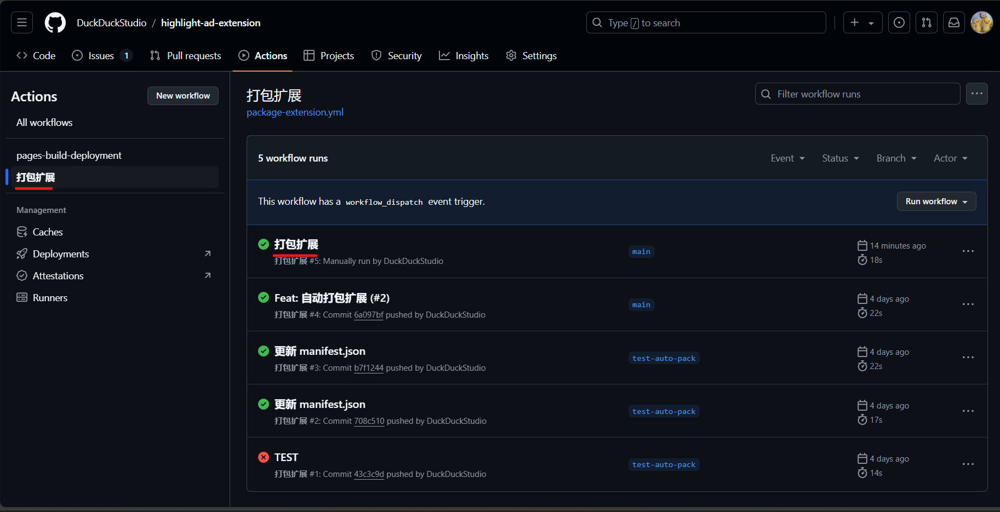
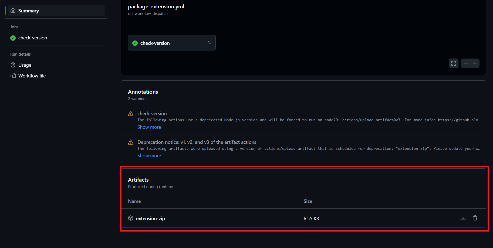

# 高亮“广告”扩展 | 代码文档

## 基本原理
找到“广告”二字 → 为“广告”二字套上`<span>`  
更多步骤请查看代码注释。  

## 代码架构
这里以GitHub仓库的架构为例

- docs → 你现在正在看的这些文档
  - ... → Note: 使用 [docsify](https://docsify.js.org/#/) 部署
- EXENSION → 扩展目录
  - icons → 扩展图标
    - hade128x128.png → $128px × 128px$ 的图标
  - content.js → 实现高亮的js脚本
  - manifest.json → 扩展的清单文件 (清单版本 V3)
  - options.html → 扩展选项页面
  - popup.html → 扩展弹出页面
  - popup.js → 扩展弹出页面相关js脚本 (获取是否开启功能)
  - styles.css → 高亮时的样式
- .gitignore → git提交时忽略的文件清单
- LICENSE → 扩展代码的开源许可证
- README.md → 同`docs`中的README.md，也就是文档的主页

## 在本地加载
### 从仓库文件加载
1. 克隆仓库
```bash
git clone https://github.com/DuckDuckStudio/highlight-ad-extension.git
```
2. 在Edge中打开扩展页(edge://extensions/)
3. 打开 **开发人员模式**  
   
4. 加载扩展  
   
5. 选中仓库目录下的`EXTENSION`目录
6. 打开支持的页面并测试效果  
   [打开必应(国内版)](https://cn.bing.com/)

### 从工作流构建文件加载
1. 访问[工作流界面](https://github.com/DuckDuckStudio/highlight-ad-extension/actions/workflows/package-extension.yml)
2. 点击最新的运行 (即使最新的运行不叫`打包扩展`)  

3. 下载工作流构建文件 (`Summary` -划到最下面-> `Artifacts`)

4. 在浏览器中加载扩展

## 局限性
- 本扩展只能高亮`广告`，而不能高亮`广 告`/`AD`/`推广`等。  
- 本扩展不能高亮一些类型的`广告`，只能高亮`Ctrl`+`F`可以搜到的`广告`。  
- 本扩展建议只在经过验证的页面上可以使用，因为未经验证的页面使用情况未知。具体验证过哪些页面可以在`manifest.json`中查看`content_scripts > matches`键的值。  

## 在本地使用 docsify 部署文档
[官方文档](https://docsify.js.org/#/zh-cn/quickstart)  
1. 安装npm (自行搜索，我是装[Node.js](https://nodejs.org/zh-cn))
2. 安装 docsify (全局)
```bash
npm i docsify-cli -g
```
3. 启动本地服务器 (我已经初始化过了)
```bash
docsify serve docs
```
4. 查看页面  
页面一般位于`http://localhost:3000`，详细页面以输出为准。  
```
Serving D:\***\highlight-ad-extension\docs now.
Listening at http://localhost:3000 ← 页面位置
```

## 添加使用扩展的页面
你可以修改扩展文件夹中的`manifest.json`中的`content_scripts > matches`键的值来添加页面。  
例如:  
(原)  
```json
{
  //...
  "content_scripts": [
    {
      "matches": [
        "https://cn.bing.com/*"
      ], 
      //...
    }
  ]
}
```
(改)  
```json
{
  //...
  "content_scripts": [
    {
      "matches": [
        "https://cn.bing.com/*",
        "https://www.baidu.com/*"
      ], 
      //...
    }
  ]
}
```

> [!NOTE]
> 你的修改必须符合JSON规范与扩展清单规范。  
> JSON不允许注释与尾随逗号。  
> 清单版本为 V3 。  

## 项目许可证
本项目基于 [MIT](https://github.com/DuckDuckStudio/highlight-ad-extension/blob/main/LICENSE) 许可证开源，以最新开源许可证为准。  
